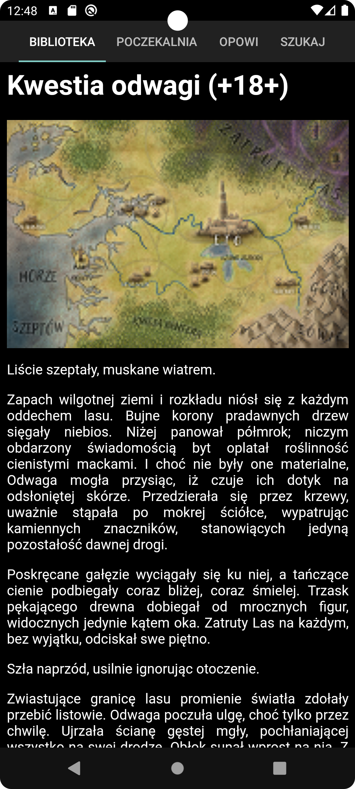

Aplikacja pozwalająca na szukanie plików EPUB w różnych wyszukiwarkach
i łączenie wyników, jak również wygodne czytanie tekstów z różnych stron,
ich eksport do EPUB i import z tego formatu.

Dostępna w Google Play: https://play.google.com/store/apps/details?id=com.mwiacek.poczytaj.mi.tato

Wersja 2.1.2 - 9.2023
1. gdy plik nie istnieje, fantastyka.pl zwraca stronę główną.
   Poprawna (a na pewno lepsza) obsługa tej sytuacji.
2. poprawka z context

Wersja 2.1.1 - 29.8.2023
1. poprawa błędu z przewijaniem stron
2. poprawa błędu z odświeżaniem stron
3. nowy Gradle

Wersja 2.1 - 7.5.2023
1. poprawna obsługa sytuacji, gdy brak internetu
2. zmieniona ważność powiadomień na LOW (nie wibrują)
3. lepsza obsługa HTML Entity w tytułach
4. info o punktach do bilbioteki na fantastyka.pl
5. opcja pozwalająca chować Navigation Bar (większa ilość miejsca
   na ekranie dla aplikacji szczególnie w starszym Androidzie) - po jej
   włączeniu Navigation Bar musi być "wysunięty" z dołu ekranu
   (opcja po zmianie wymaga restartu apki)
6. długi klik na pozycji na liście otwiera ją w Chrome (łatwo można np. dodać
   komentarz)
7. wyłączenie zbierania domyślnych metryk przez Google (WebView.MetricsOptOut) - 
   więcej https://developer.android.com/develop/ui/views/layout/webapps/managing-webview#metrics
8. pokazywanie informacji, jaką część tekstu przeczytano (na razie Snackbar)
9. nowa kategoria pomarańczowa tekstów - po włączeniu opcji w zakładce
   i dojściu do końca tekstu jest on automatycznie przesuwany do pomarańczowych
   (po wyłączeniu opcji, jeżeli ktoś chce ręcznie przesunąć tekst do czerwonych
   lub zielonych, czyli np. dobrych i złych, może robić to ręcznie jak wcześniej)
10. opcja pozwalająca włączyć blokowanie wyłączania ekranu (po zmianie wymaga
    restartu apki)
11. opcja wyboru wielkości czcionki czytania

Wersja 2.0.1 - 4.2023
1. zablokowanie gestów lewo/prawo w różnych miejscach - przełączanie
   między zakładkami robione jest przez kliknięcie na nazwie zakładki
   (naprawia to scrollowanie góra/dół)
2. zmiana layoutu - przy scrollowaniu w dół chowane są nazwy zakładek
   (można czytać na pełnym ekranie)
3. wsparcie dla czarnego trybu w najnowszym Androidzie
4. refaktoring kodu
5. wsparcie dla trybu multi-window (możliwość pokazywania na ekranie
   wraz z drugą zakładką) i zmiany orientacji - poprawka błędu z konstruktorem
   fragmentów
6. po kliknięciu na powiadomienie jesteśmy przeniesieni do aplikacji
7. dodane uprawnienie POST_NOTIFICATIONS (wymagane, żeby pokazywać powiadomienia)
8. pobieranie plików w Android 13+ działa (inny model uprawnień)
9. poprawka różnych A resource was acquired at attached stack trace but never released.
10. poprawka związana z wolnym czytaniem obrazków (dodatkowo widać postęp)

Uwagi:
1. aplikacja nie zawsze scrolluje do ostatnio czytanego miejsca
   (prawdopodobnie związanie ze NestedScrollView)
2. aplikacja nie zbiera żadnych danych o urządzeniu czy użytkowniku
   (ani nigdzie ich nie wysyła)
3. TODO czerwone teksty (niewidoczne na serwerze)
4. TODO up down przy szukaniu - FloatingActionButton
5. TODO TOR
6. TODO Google Books ?
7. TODO sortowanie szukania ?
8. TODO sync z szukaniem systemowym ?

Obecnie wymagane uprawnienia:
1. POST_NOTIFICATIONS - powiadomienia (Android >= 13)
2. INTERNET - to chyba oczywiste
3. ACCESS_NETWORK_STATE - żeby móc czytać pliki ze stron w tle po włączeniu
   funkcji przez użytkownika
4. WRITE_EXTERNAL_STORAGE - bez niego nie można pobrać pliku EPUB
   (Android < 13)

Wersja 2.0 - 2022
1. Dodano czytanie tekstów, import i eksport z EPUB (strony fantastyka.pl i opowi.pl).
2. Całość przepisano z użyciem androidx

https://mwiacek.com/www/?q=node/555

Wersja 1.0 - 2017 
Dostępna jest możliwość wyszukiwania

https://mwiacek.com/www/?q=node/360

